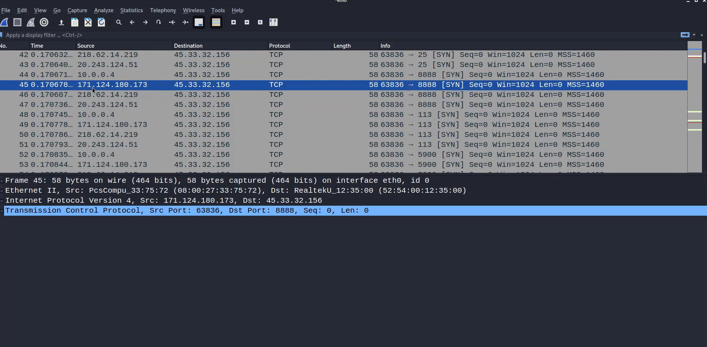
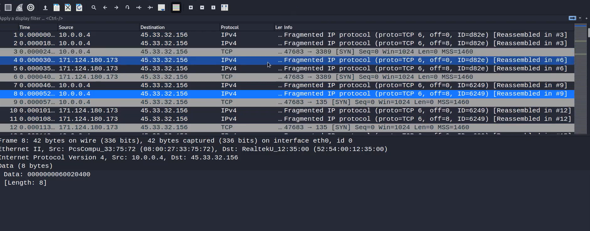

#  Nmap Firewall Evasion Techniques (Decoy + Fragmentation Analysis)

##  Objective
To analyze advanced Nmap evasion techniques including decoy scanning and packet fragmentation, and observe their behavior using Wireshark.

---

## Tools Used
- Nmap
- Wireshark
- Linux (Kali/Ubuntu)

---

##  Target
- scanme.nmap.org (45.33.32.156)

---

##  Scan Command
sudo nmap -sS -sV -F -f --send-eth -D 171.124.180.173 scanme.nmap.org

---

##  Key Concepts

###  SYN (Stealth) Scan
- Sends SYN packets without completing the TCP handshake  
- Faster and less detectable than full TCP scans  

---

###  Decoy Scanning (`-D`)
- Sends packets from multiple IP addresses (real + fake)  
- Hides the real attacker among decoys  

---

### Packet Fragmentation (`-f`)
- Splits packets into smaller fragments  
- Helps bypass simple firewall filtering  
- Makes packet inspection more difficult  

---

##  Wireshark Analysis

### 🔹 Decoy Scan Observation
- Multiple **source IP addresses** observed  
- All IPs send SYN packets to the same destination  
- Same scanning pattern across different IPs  

 This indicates use of **decoy scanning**

---

### 🔹 Fragmentation Scan Observation
- Packets labeled as **“Fragmented IP protocol”**  
- Fragment offsets observed (offset=0, offset=8)  
- Wireshark shows **“Reassembled in #X”**  

 This confirms packet fragmentation is in use

---

##  Evidence

### 🔹 Decoy Scan (Multiple Source IPs)

 Multiple IPs targeting the same host indicate attempt to hide the real attacker.

---

### 🔹 Fragmentation Scan (Split Packets)

 Packets are broken into smaller fragments, making detection harder.

---

##  Combined Analysis (Decoy + Fragmentation)

The scan demonstrates two advanced evasion techniques:

### 1. Decoy Technique
- Multiple IPs appear as source  
- Confuses logging systems  
- Makes attribution difficult  

### 2. Fragmentation Technique
- Packets are split into fragments  
- Bypasses simple firewall inspection  

# Combined Effect

When both techniques are used together:

- Source identity is hidden  
- Packet inspection is bypassed  
- Detection becomes significantly harder  

This represents a real-world reconnaissance evasion method used by attackers.

---

# Real-World Insight

Attackers use these techniques to:

- Avoid firewall detection  
- Bypass intrusion detection systems  
- Obfuscate scanning activity  

---

# Defensive Perspective

Security analysts should monitor:

- Multiple source IPs targeting same host  
- Repeated SYN packets from different sources  
- Fragmented packets requiring reassembly  

👉 These patterns indicate possible evasion attempts.

---

# Skills Demonstrated

- Advanced Nmap Scanning  
- Firewall Evasion Techniques  
- Packet-Level Analysis  
- Wireshark Investigation  
- Cybersecurity Threat Analysis  

---

# Limitations

- Modern IDS/IPS can detect fragmented traffic  
- Decoy scans are not fully anonymous  
- Advanced systems can still identify patterns  

---

# Conclusion

This project demonstrates how attackers combine decoy scanning and packet fragmentation to evade detection.

Understanding these techniques is essential for identifying and defending against reconnaissance activity in real-world environments.

---

# Note

This scan was performed on an official test server (scanme.nmap.org) for educational purposes only.
