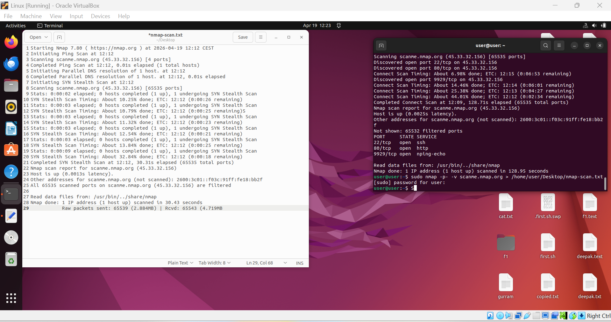

#  Nmap Full Port Scan Analysis

# Objective
To perform a full TCP port scan using Nmap and analyze how modern systems respond to scanning attempts.

---

# Tool Used
- Nmap

---

# Target
- scanme.nmap.org

---

# Scan Command
sudo nmap -p- -T4 -v scanme.nmap.org >

---

# Scan Explanation

- `-p-` → Scans all 65535 ports  
- `-T4` → Increases scan speed  
- `-v` → Shows detailed progress  
- `sudo` → Enables full scan capabilities  
- `>` → Saves output to a file  

---

# Scan Results

The scan completed successfully with the following observations:

- Total ports scanned: **65535**
- Host status: **Up**
- Result: **All ports filtered**

---

# Analysis

All ports were marked as **filtered**, which indicates:

- A firewall or filtering system is active  
- The target is blocking incoming scan probes  
- No direct port information is exposed  

This behavior is common in modern, well-secured systems.

---

# Evidence

---

# Real-World Insight

Filtered ports are a strong indicator of defensive mechanisms such as firewalls or intrusion prevention systems.  

This demonstrates how organizations protect their infrastructure from reconnaissance and scanning attempts.

---

# Skills Demonstrated

- Network Scanning  
- Port Enumeration  
- Firewall Detection  
- Linux Command Usage  
- Security Analysis  

---

# Conclusion

The Nmap scan confirmed that the target system is protected by filtering mechanisms that prevent exposure of open ports.  

This highlights the importance of network defense strategies in real-world environments.

---

#  Recommendation

- Use firewalls to restrict unnecessary traffic  
- Monitor scanning attempts  
- Implement intrusion detection systems  

---

#  Note

This scan was performed on an official test server (scanme.nmap.org) for educational purposes only.
