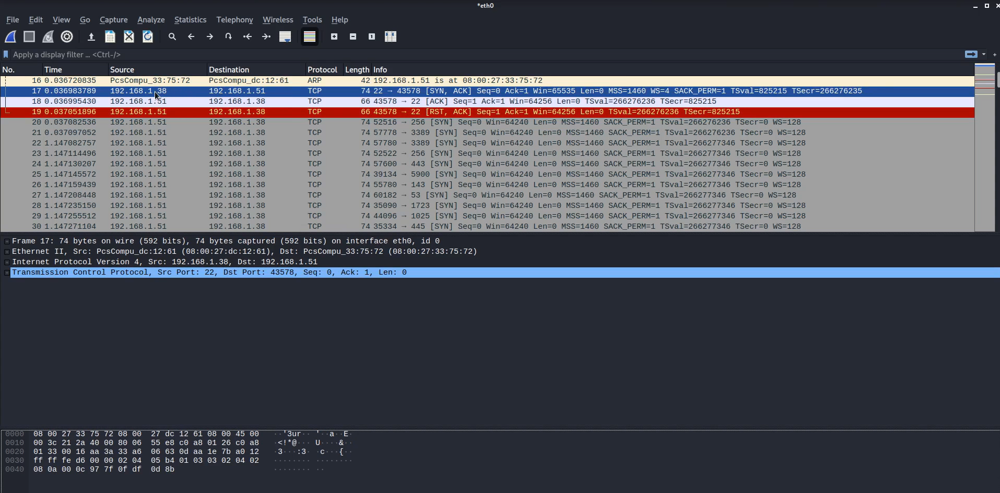
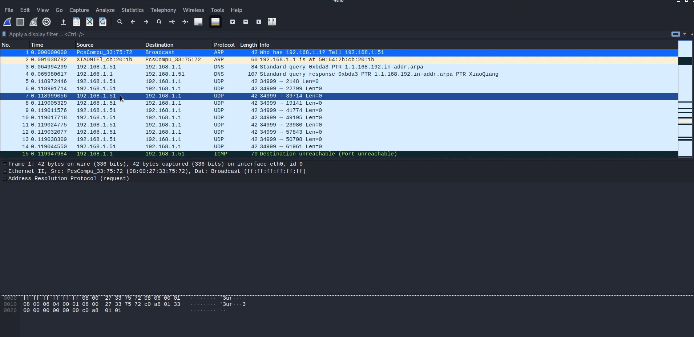

#  TCP vs UDP Scan Analysis using Nmap & Wireshark

# Objective
To analyze how TCP and UDP scans behave at the network level using Nmap and Wireshark, and understand how different protocols respond during port scanning.

---

# Tools Used
- Nmap
- Wireshark
- Linux (Kali/Ubuntu)

---

# Target
- Internal Network Host (192.168.1.38 / 192.168.1.51)

---

# Scan Commands

### TCP Connect Scan :sudo nmap -sT 192.168.1.38

### UDP Scan: sudo nmap -sU 192.168.1.38

---

##  TCP Scan Analysis (Three-Way Handshake)

TCP scanning uses a full connection process:

### Steps:
1. SYN → Client requests connection  
2. SYN-ACK → Server responds  
3. ACK → Connection established  

### Observations

- SYN packet sent from scanner  
- SYN-ACK received from target (port open)  
- ACK sent → connection completed  
- RST used to close connection  

👉 This confirms:
- TCP scan establishes a full connection  
- Easily detectable by IDS/Firewall  

---

##  Evidence (TCP Scan)

---

##  UDP Scan Analysis

UDP is connectionless (no handshake)
##  Why UDP Does Not Use a 3-Way Handshake

UDP (User Datagram Protocol) is a **connectionless protocol**, meaning it does not establish a connection before sending data.

Unlike TCP, UDP:

- Does not perform SYN, SYN-ACK, ACK steps  
- Does not guarantee delivery  
- Does not confirm if the receiver is ready  

Instead, UDP simply sends packets directly to the target.

###  In Scanning Context

- If a UDP port is **closed**, the target responds with an ICMP “Port Unreachable” message  
- If a UDP port is **open**, there is usually **no response**  

This makes UDP scanning slower and less reliable compared to TCP scanning.

###  Key Insight

Because UDP lacks a handshake mechanism, it is harder to detect and interpret, which is why attackers sometimes use it for stealthier reconnaissance.

###  Observations

- Multiple UDP packets sent to target ports  
- No response from open ports  
- ICMP “Destination Unreachable (Port Unreachable)” received  

👉 This means:
- No response → port may be open or filtered  
- ICMP response → port is closed
- 

---

##  Evidence (UDP Scan)

---

##  TCP vs UDP Comparison

| Feature | TCP Scan (-sT) | UDP Scan (-sU) |
|--------|---------------|---------------|
| Connection | Full handshake | No connection |
| Speed | Faster | Slower |
| Detection | Easy | Harder |
| Response | Clear | Ambiguous |
| Reliability | High | Low |

---

##  Real-World Insight

- TCP scans are commonly used for reliable service detection  
- UDP scans are used for stealth but are harder to interpret  
- Attackers combine both for full reconnaissance  

---

##  Skills Demonstrated

- Network Traffic Analysis  
- TCP/IP Protocol Understanding  
- Nmap Scanning Techniques  
- Wireshark Packet Inspection  
- Security Analysis  

---

##  Conclusion

The analysis demonstrates how TCP and UDP behave differently during scanning:

- TCP provides clear connection-based responses  
- UDP relies on indirect responses like ICMP  

This highlights the importance of understanding protocol behavior in cybersecurity analysis.

---

##  Recommendation

- Monitor TCP connection attempts  
- Analyze ICMP traffic for hidden scans  
- Use IDS/IPS to detect scanning behavior  

---

##  Note

This analysis was performed in a controlled lab environment for educational purposes.
